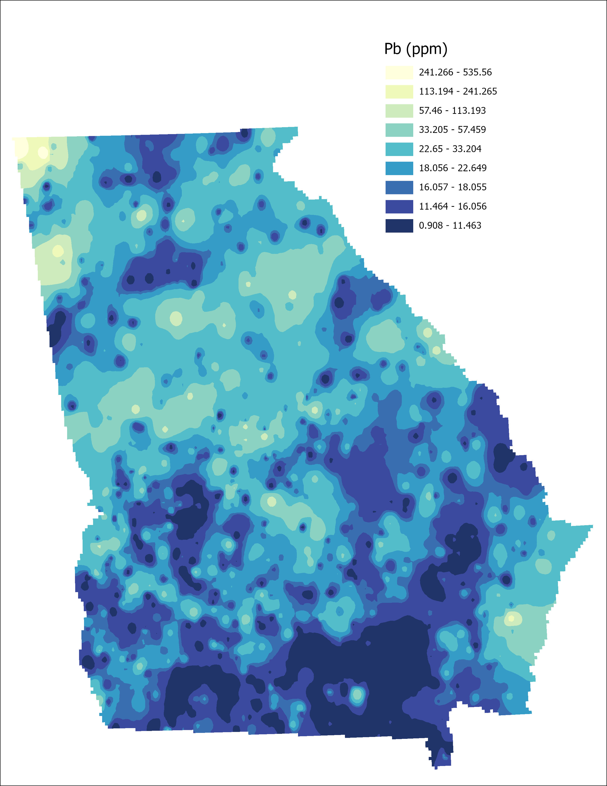

# gis-portfolio

This project attempts to identify bald eagles’ habitat in Georgia by looking for a natural environment that provides a suitable location and enough food sources. The criteria used for selecting a location are as follows.

## Suitability mode

The ordinal combination is used to evaluate the suitability of potential habitat for bald eagles in Georgia. I concatenated the layers to identify potential habitat. However, this is an intermediate result. The final result will be detailed, followed by the maps in the next few pages.

| Criteria |
| :---:   |
| Forest (must be pines trees or cypress trees) |
| Water body (must intersect with forest) |
| Away from human disturbance (0.5 miles away from highway) |
| Tree canopy cover percentage (20 to 60%) |
| Low risk of lead poisoning (soil test result less than 100 ppm) |

## Data used

| **    Data Layer    **                     | **    Data Type    **    | **    Resolution   ** | **    Source   **                                                                                     | **    Description    **                                                                         | **    Date   **               |
|--------------------------------------------|--------------------------|-----------------------|-------------------------------------------------------------------------------------------------------|-------------------------------------------------------------------------------------------------|-------------------------------|
|     National Hydrography Dataset (NHD)     |     Vector:   polygon    |                       |     https://prd-tnm.s3.amazonaws.com/index.html?prefix=StagedProducts/Hydrography/NHD/State/Shape/    |     Lake/pond and   waterbodies are presented as water-polygon features                         |     2023-12-27                |
|     USFS Tree Canopy Cover                 |     Raster               |     Cell size: 30m    |     https://data.fs.usda.gov/geodata/rastergateway/treecanopycover/#docref                            |     Tree canopy cover percentage range from 0 to 100% for each   cell                           |     Accesses on 2024-03-02    |
|     National Forest Type                   |     Raster               |     Cell size: 30m    |     https://data.fs.usda.gov/geodata/rastergateway/forest_type/index.php                              |     Contains   the extent, distribution, and forest type composition of the nation’s forests    |     Accesses on 2024-03-02    |
|     Georgia Primary and secondary roads    |     Vector: line         |                       |     https://www2.census.gov/geo/tiger/TIGER_RD18/STATE/13_GEORGIA/13/                                 |     Contains highway and interstate highway                                                     |     2023-01-06                |
|     Georgia state boundary                 |     Vector: line         |                       |     https://www2.census.gov/geo/tiger/TIGER_RD18/STATE/13_GEORGIA/13/                                 |     State boundary                                                                              |     2023-01-06                |
|     USGS National Geochemical Survey       |     Vector: point        |                       |     https://mrdata.usgs.gov/geochem/                                                                  |     geochemical analysis of soils                                                               |     Accesses on 2024-03-02    |
