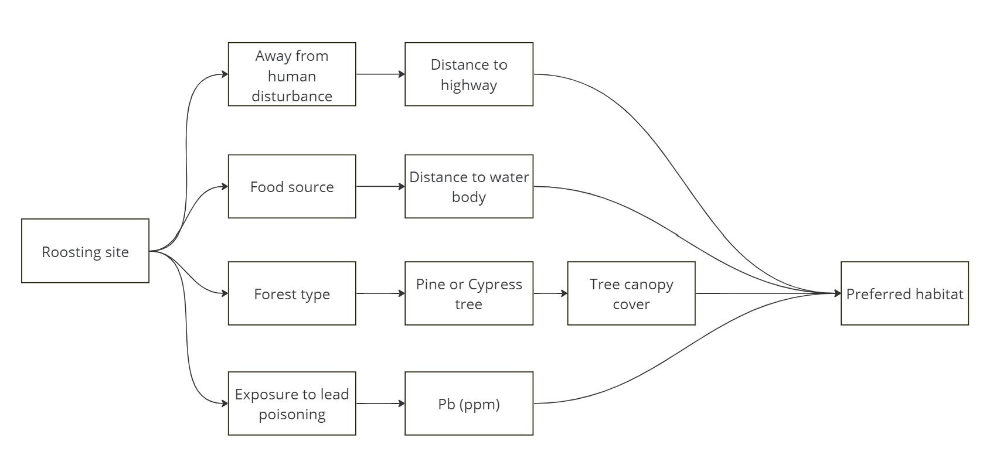

## Research objective

This project attempts to identify bald eagles’ habitat in Georgia by looking for a natural environment that provides a suitable location and enough food sources. The criteria used for selecting a location are as follows.

| Criteria |
|---|
| Forest (must be pines trees or cypress trees) |
| Water body (must intersect with forest) |
| Away from human disturbance (0.5 miles away from highway) |
| Tree canopy cover percentage (20 to 60%) |
| Low risk of lead poisoning (soil test result less than 100 ppm) |

 
 

## Data used

| **Data Layer**                     | **Data Type**    | **Resolution** | **Source**                                                                                     | **Description**                                                                         | **Date**               |
|--------------------------------------------|--------------------------|-----------------------|-------------------------------------------------------------------------------------------------------|-------------------------------------------------------------------------------------------------|-------------------------------|
|     National Hydrography Dataset (NHD)     |     Vector:   polygon    |                       |     https://prd-tnm.s3.amazonaws.com/index.html?prefix=StagedProducts/Hydrography/NHD/State/Shape/    |     Lake/pond and   waterbodies are presented as water-polygon features                         |     2023-12-27                |
|     USFS Tree Canopy Cover                 |     Raster               |     Cell size: 30m    |     https://data.fs.usda.gov/geodata/rastergateway/treecanopycover/#docref                            |     Tree canopy cover percentage range from 0 to 100% for each   cell                           |     Accesses on 2024-03-02    |
|     National Forest Type                   |     Raster               |     Cell size: 30m    |     https://data.fs.usda.gov/geodata/rastergateway/forest_type/index.php                              |     Contains   the extent, distribution, and forest type composition of the nation’s forests    |     Accesses on 2024-03-02    |
|     Georgia Primary and secondary roads    |     Vector: line         |                       |     https://www2.census.gov/geo/tiger/TIGER_RD18/STATE/13_GEORGIA/13/                                 |     Contains highway and interstate highway                                                     |     2023-01-06                |
|     Georgia state boundary                 |     Vector: line         |                       |     https://www2.census.gov/geo/tiger/TIGER_RD18/STATE/13_GEORGIA/13/                                 |     State boundary                                                                              |     2023-01-06                |
|     USGS National Geochemical Survey       |     Vector: point        |                       |     https://mrdata.usgs.gov/geochem/                                                                  |     geochemical analysis of soils                                                               |     Accesses on 2024-03-02    |

 
 

## Suitability model
The ordinal combination is used to evaluate the suitability of potential habitat for bald eagles in Georgia. I concatenated the layers to identify potential habitat. However, this is an intermediate result. The final result will be detailed, followed by the maps in the next few pages.

_Rating schedule_
| **Factor** | **Constraint** | **Factor Constraint** |
|---|---|---|
|     Tree canopy cover percentage    |     < 20    |     0    |
|          |     ≥ 20 AND < 60    |     1    |
|          |     ≥ 60    |     2    |
|     Pb (ppm) in soils    |     < 100    |     0    |
|          |     ≥ 100 AND < 400     |     1    |
|          |     ≥ 400    |     2    |

 

  

 
 

  

 
Following is the final result showing the optimal habitat for bald eagles in Georgia. I found that most of the optimal habitats are quite fragmented.

 
The following counties in Georgia are identified as optimal habitats for bald eagles: Liberty, Ware, Camden, Calhoun, and Rabun. The optimal habitats are fewer than I expected. Limiting variables in this project include lead poisoning risk level, distance to highway, and forest type.

|Suitable habitat in East Georgia|Suitable habitat in Southeast Georgia|
|:-:|:-:|
|||

|Suitable habitat in Southwest Georgia|Suitable habitat in Northeast Georgia|
|:-:|:-:|
|||

 
To better identify forest areas that are qualified for tree canopy cover requirements. I clipped tree canopy cover raster (Georgia) by using qualified forest areas (polygon) that are 0.5 miles away from the highway, within 1 mile of water body, are pine or cypress trees type, and have low risk of lead poisoning. I then converted the clipped raster into a polygon. Next, I used spatial join to join clipped raster to forest areas if cells are completely contained by forest areas and used field mapping to get the mean of tree canopy cover for each forest area. Note that each cell size is the same, so the average tree canopy cover percentage won’t be biased.
The following criteria are used for creating intermediate and final maps.

_Away from human disturbance_\
I created a 0.5-mile buffer around the highway to remove water bodies and forests that fall within the buffer. Category H in National Bald Eagle Management Guidelines regarding blasting and other loud, intermittent noises states that “[a]void blasting and other activities that produce extremely loud noises within 1/2 mile of active nests, unless the eagles have demonstrated greater tolerance to the activity (or similar activity) in the nesting area” (U.S. Fish and Wildlife Service, 2007). In this sense, highway traffic is considered intermittent noise pollution. A 0.5-mile buffer is considered appropriate. 

_Food source_\
Bald eagles’ primary food is fish, which might explain why bald eagles typically can be found near bodies of open water (National Park Service; Nye). In addition, bald eagle nests are “within 1 mile of a lake, river, or marine shoreline” (Derek W. Stinson, 2007). To select areas with a potential abundance of food supply for bald eagles, I created a one-mile buffer of water bodies and removed those within 0.5 miles of the highway.

_Forest type_\
Although tree shape, size, and location are relatively more important than the type of trees that bald eagles use for nesting, there are certain types of trees likely to meet nesting needs, such as pines, firs, oaks, spruces, and cottonwoods (Iowa Department of Natural Resources). With that being said, things are different in Georgia. It was found that approximately 95 percent of bald eagles’ nests are built in living, mature pine trees in Georgia (Georgia Department of Natural Resources). I converted the U.S. National Forest type image to a polygon, then selected the following forest types if they are in Georgia. I then remove forest areas not within 1 mile of the water body.

_Lead poisoning_\
Bald eagles have been found to be suffering from the consequences of lead poisoning (National Park Service; USGS, 2022). Half of the US bald eagle population suffered from the poisoning (Ali, 2022). In addition, bald eagles can be exposed to lead poisoning directly and indirectly by ingesting spent lead ammunition or preying on another animal that has been shot with ammunition or has ingested lead (Haig et al., 2014; Kolb, 2018). To identify a relatively clean and safe environment, I interpolated lead poisoning (Pb by ppm) in Georgia and then reclassified it for comparison. Following images show the Pb level in Georgia.

|Lead(Pb) by ppm|Lead(Pb) by risk|
|:-:|:-:|
|||

_Tree canopy cover_\
I clip the tree canopy cover raster by using the Georgia state boundary as a clipping feature. The preferred condition of tree canopy cover was found to range from 20 to 60 percent (Peterson, 1986). The image on the left-hand side shows each cell's tree canopy cover percentage (0 to 100%). The one on the right-hand side is reclassified.

|Tree Canopy Cover|Reclassify Tree Canopy Cover|
|:-:|:-:|
|||

 
_Workflow_\

