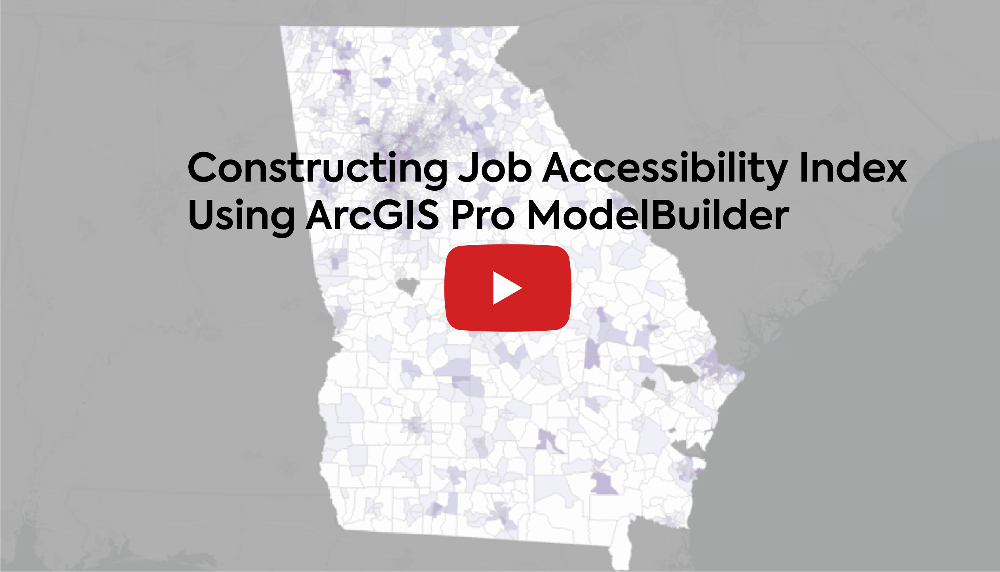

## Contents
- ModelBuilder Example I: [Euclidean and Network distance Thiessen Buffer](#Euclidean-and-Network-distance-Thiessen-Buffer)
- ModelBuilder Example II: [Gravity-based job accessibility index](#Gravity-based-job-accessibility-index)

<br><br>


## Euclidean and Network distance Thiessen Buffer
In the majority of analyses concerning bike share demand, researchers employ a Euclidean buffer to examine the attractions surrounding bike stations. However, this method may lead to biased results, despite the apparent similarity in coverage produced by both Euclidean and network distances. The advantage of creating buffers by integrating Thiessen polygons is that every attraction within the buffer is located closer to the corresponding bike station. The following images illustrate the differences between Thiessen buffers using Euclidean and network distances. Learn more about my bike-sharing demand analysis project [here](../images/projects/Los-Angeles-Metro-bike-sharing-demand-analysis.md).
<br><br>

| Euclidean distance | Network distance |
|:-:|:-:|
|||

<br><br>

I create a tool to generate network distances of 300, 500, and 800 meters. Below is a demonstration of creating Network Distance Thiessen Buffer using 300-meter buffer as an example. I first create this in ModelBuilder and then convert it into a tool in ArcGIS Pro.


https://github.com/rc-tsai/gis-portfolio/assets/139235338/a68ba4d0-bb21-4f6c-a2d6-fa9eae097ea8


<br><br>


The following workflow delineates the steps involved in creating a Network Distance Thiessen Buffer.
<div style="text-align: center;">
  <strong>Network Distance Thiessen Buffer Workflow</strong>
  <br>
<div style="text-align: center;">
  
</div>
<br>
  
- First, construct 300m service area (Network Analyst) from points
- Second, create Thiessen polygons from points
- Third, extract the Thiessen polygon lines using the Polygon to Line tool
- Fourth, use the Intersect tool on the results from the first and third steps
- Fifth, extract the buffer boundary by using Polygon to Line again on the buffer, then dissolve
- Sixth, use Feature to Polygon on the results from the fourth and fifth steps

<br><br>

## Gravity-based job accessibility index

<br>

This video demonstrates the steps involved in constructing a job accessibility index for lower-paying jobs using ArcGIS Pro ModelBuilder. I have developed five tools for constructing job accessibility that allow users to input their data after pre-processing it by following the [steps outlined below](#Pre-processing-data).

<br>

[](https://www.youtube.com/watch?v=rrXHwuJhhfw)

<br>

The following section contains the steps for preparing data to build a job accessibility index. First, let's review the gravity-based job accessibility index as follows:

<br>
<p align="center">
  $A_{i} = \displaystyle\sum_{j} [\frac{E_{j} \cdot f(d_{ij})}{\displaystyle\sum_{k} P_{k} \cdot f(d_{jk})}]$
</p>
<br>

$`A_{i}`$ = job accessibility in census tract 𝑖 (measured census tract)

$`E_{j}`$ = number of jobs in census tract 𝑗

$`P_{k}`$ = number of jobseekers (job competitors) in census tract 𝑘

$`f(d_{ij} = e^{-\beta(k) \cdot t}`$ (time decay funtion, $`b`$ = non-negative time decay coefficient, $`t`$ = travel time in minute, $`k`$ = area type)

_Note. Area type is categorized as Metropolitan area, Small town, or Rural area based on [USDA Rural-Urban Commuting Area Codes](https://www.ers.usda.gov/data-products/rural-urban-commuting-area-codes/)_

<br>

## _Pre-processing data_

### _Obtaining jobs and workers at the census tract level_

Initially, I aggregate the total number of low-paying jobs and workers (earning less than $1,250/month) at the census tract level, respectively. It is important to note that the [LEHD LODES](https://lehd.ces.census.gov/data/) data, which links employer-household information, facilitates this process. Aggregating low-paying Origin-Destination (OD) trips at the Residence Census Block Code effectively yields the number of low-paying workers at the census block level. Similarly, aggregating low-paying OD trips at the Work Census Block Code corresponds to obtaining the number of jobs at the census block level. However, for the purpose of calculating the job accessibility index, I aggregate this data at the census tract level, which is the most commonly used geographic unit in existing literature. Further details on the steps involved can be found [here](../miscellaneous/low_paying_worker_job.ipynb).

Secondly, I export the aggregated data as CSV files and then import them into ArcGIS Pro. Utilizing the Export Table tool, I prepare the data before joining it to the corresponding census tract. Subsequently, I generate centroids for each census tract and add two fields: 'low_job' and 'low_worker', both of which are designated as DOUBLE data types. I calculate the 'low_job' values following the initial join and then remove the join. I repeat the same process for 'low_worker.'

<br>

### _Classify rural-urban census tract_
I classify census tracts into three categories: Metropolitan, Small town, and Rural based on the classification provided by [USDA Rural-Urban Commuting Area Codes](https://www.ers.usda.gov/data-products/rural-urban-commuting-area-codes/). However, 2020 classification [would be released no earlier than Fall 2024](https://www.ers.usda.gov/data-products/rural-urban-commuting-area-codes/#:~:text=Currently%2C%20we%20estimate%20that%20the%202020%20RUCA%20codes%20would%20be%20released%20no%20earlier%20than%20Fall%202024), so I use the classification of 2010 on census tracts 2020 with some modification as follows:
- I add the 2010 census tracts from ArcGIS Online and then utilize the Copy Feature tool (as the layer imported from ArcGIS Online cannot be edited directly)
- I filter out records pertaining to Georgia and then export these to a CSV file, which is subsequently imported as a table in ArcGIS Pro
- I join this table to the 2010 census tracts. Unlike the 'GEOID_NUM', which is a DOUBLE data type used in joining low-paying workers and jobs, I add a text field in the export table
- I add a text field named 'Area_Type' and apply the following classification to calculate 'Area_Type':
```python
Area_Type = area_type(!RUCA!)

def area_type(x):
    if 1 <= x <= 6:
        return "Metropolitan"
    elif 7 <= x <= 9:
        return "Small town"
    else:
        return "Rural"
```
- Utilize the "Feature to Point" tool to generate centroids for the 2020 census tracts
- Perform a spatial join, using the 2020 census tract centroids as the target feature and the 2010 census tract polygons as the join feature
- We now classify the 2020 census tracts into three categories

<br>

### _Assign time decay coefficient to the corresponding census tract_
I estimate the travel time decay coefficient [here](../miscellaneous/Time-decay-coefficient-for-gravity-based-job-accessibility-index.ipynb). Time decay coefficients are used to penalize the desirability of jobs that are located further away relative to closer ones, indicating an inverse relationship between the desirability of a job and the distance from the job seeker's residential location. To assign the corresponding coefficient:

- I add a text field 'TimeDecay_Beta' in the result of spatial join done in previous step
- Calculate the field by using:
```python
TimeDecay_Beta = beta(!Area_Type!)

def beta(x):
    if x == 'Metropolitan':
        return 0.0278
    elif x == 'Small town':
        return 0.0292
    else:
        return 0.0259
```
<br>

To derive the job accessibility index, I first normalize the total low-paying jobs at census tract by the total number of low-paying workers that can reach those jobs in that census tract. By doing so, the index accounts for job competition among job seekers. I calculate the job access index in two steps:

1. Normalize jobs at the census tract level
2. Calculate reachable normalized jobs from each census tract

<br>

This is the job access equation:
<p align="center">
  $A_{i} = \displaystyle\sum_{j} [\frac{E_{j} \cdot f(d_{ij})}{\displaystyle\sum_{k} P_{k} \cdot f(d_{jk})}]$
</p>


This is normalized jobs at ceneus tract:
<p align="center" style="font-size: larger;">
  $$\frac{E_{j}}{\displaystyle\sum_{k} P_{k} \cdot f(d_{jk})}$$
</p>
<br>

### _Normalize jobs at the census tract level_
First, add a text field 'CTID_lowjob' to concatenate census tract GEOID and 'low_job'
```python
CTID_lowjob = !GEOID! + "-" +str(int(!low_job!))
```
<br>
Secondly, add another text field 'Worker_Beta' to ocncatenate total worker in each census tract and time decay coefficient

```python
Worker_Beta = str(int(!low_worker!)) + "-" +str(!TimeDecay_Beta!)
```

Next, we filter out census tracts that don't have low-paying jobs.

<br>

### _Building job accessibility index in ModelBuilder_

- Step 1: Create a job competition OD (Origin-Destination) Matrix

<p align="center">
  
</p>

<br>

- Step 2: Normalize jobs at the census tract level

<p align="center">
  
</p>

<br>

- Step 3: Create access to reachable jobs (within a 30-minute drive) OD Matrix

<p align="center">
  
</p>

<br>

- Step 4: Calculate job accessibility

<p align="center">
  
</p>

<br>

- Step 5: Visualize job accessibility

<p align="center">
  
</p>
