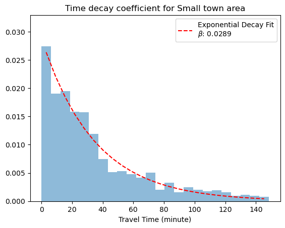

## Contents
- [Background](#Background) 
- [Variable selection](#Variable-selection-Return-to-Contents) 
- [Data](#Data-Return-to-Contents)
- [Data assembly](#Data-assembly-Return-to-Contents) 
- [Methods](#Methods-Return-to-Contents) 
- [Result](#Result-Return-to-Contents)
   

## Background

Considerable research has been conducted into various types of unemployment, with three major categories being structural, frictional, and cyclical unemployment. The Reserve Bank of Australia has provided clear explanations of these types.

The first type, involuntary unemployment, arises from a mismatch between a worker's qualifications or skills and the requirements of available jobs, or when available jobs are geographically distant from job seekers. The second type, voluntary unemployment, occurs when workers voluntarily leave their current job to search for another, creating a transitional gap. The third type of unemployment occurs due to changes in economic activity during the business cycle, where the demand for workers by businesses is lower than the number of available job seekers.

A body of literature has examined unemployment at both macro and micro levels, exploring the relationship between economic factors, socioeconomic characteristics, and their direct or indirect impacts on unemployment.

  

## Variable selection (return to [Contents](#Contents))
 

_Social benefits (Public Assistance Income)_  
[Alcan et al. (2016)](https://documents1.worldbank.org/curated/en/947141471889365784/pdf/WPS7801.pdf) maintain that receiving social benefits lead to protracted unemployment duration and a slower transition from unemployed to employed status (p. 2). [Røed and Zhang (2003)](https://doi.org/10.1111/1468-0297.00086) find that a marginal increase in unemployment benefits reduces the escape rate from unemployment significantly, regardless business cycle conditions and unemployment duration (p. 204). [Kupets (2006)](https://doi.org/10.1016/j.jce.2006.02.006) find that recipients of unemployment benefits tend to have longer unemployment duration if they have income from casual work such farming (p. 244). I use the census variable on public assistance income which includes cash and non-cash benefits to low-income individuals or families.    

_Household with a mortgage_  
[Baert et al. (2014)](https://doi.org/10.1007/s10645-014-9236-6) investigate into the relationship between unemployment duration and mortgage payment, concluding that outright owners stay unemployed longer than homeowners who has a mortgage (p. 280). Given that homeowners have a mortgage to pay, which press them to get a job faster than outright homeowners, which may lead to lower unemployment rate.
   

_Lower-paying jobs to worker ratio_  
[Mahmood et al. (2014)](https://www.jstor.org/stable/24398836) conduct a stepwise regression model to examine the factors that have an impact on unemployment. In their final best fit model, they point out that labor force has a positively effect on unemployment rate, while foreign direct investment (FDI) and inflation has a negative effect on the unemployment (p. 1173). Although stepwise regression has been considered a relatively coarse method, it serves well in exploratory analysis.
   

_Lower-paying jobs to worker dissimilarity_  
[Ihlanfeldt (1994)](https://www.jstor.org/stable/20868372) illustrates that racial discrimination constrains the residential locations of blacks, results in a smaller job opportunity set. Consequently, leading to higher black unemployment given that there is less chance for a successful match to occur between workers and jobs (p. 221). This concept has been referred by researchers as one of the spatial mismatch hypotheses. To measure spatial mismatch, dissimilarity index has been widely used by researchers. Stoll and Covington (2012) construct dissimilarity index to measure spatial imbalance between workers’ job and residential locations at the ZIP code for 267 metropolitan areas. Their methods result in a single value for a metropolitan area is convenient for interpretation.   
It's important to note the distinction between the measurements of Lower-paying jobs to worker ratio and Lower-paying jobs to worker dissimilarity, despite their apparent similarity in involving the number of lower-paying jobs and workers. These metrics differ in nature. In my regression model, the first measurement serves as an indicator of the ease of accessing nearby jobs in a given census tract, operating under the assumption that low-income workers typically secure employment nearby due to limited access to information about available lower-paying jobs. On the other hand, Lower-paying jobs to worker dissimilarity assesses the level of worker-job segregation within a census tract relative to all other tracts in the state of Georgia. Both variables are valuable for comparison with the job accessibility index constructed from a gravity-based model. Indeed, I assessed the variance inflation factor to ensure that the inclusion of these two variables does not pose any issues.
   

_Job Accessibility Index for lower-paying jobs_  
[Jin and Paulsen (2018](https://doi.org/10.1177/0042098016684099) find that increases in job accessibility lead to decreases in unemployment for African Americans. Their findings also show that increased job accessibility reduces unemployment and improves household income for low-income households (p. 108).
   

_Dissimilarity_  
The dissimilarity index is a single value for the entire study area, it tells us percent of population in the study area need to relocate in order to achieve minimum job-worker dissimilarity. The equation for the dissimilarity index is computed as follows:

 

  $D = \frac{1}{2} \displaystyle\sum_{i}^{n} | \frac{Black_{i}}{Black} - \frac{Employment_{i}}{Employment} |$

 

$`Black_{i}`$ = Black population residing in ZIP code $`i`$

$`Black`$ = Total Black population in a given Metropolitan Statistical Area (MSA)

$`Employment_{i}`$ = Jobs in each ZIP code

$`Employment`$ = Total jobs in a Metropolitan Statistical Area

 

To interpret the dissimilarity index, for instance, $`D = 0.518`$, [Stoll & Covington (2011)](https://doi.org/10.1177/0042098011427180)) state that "about 52 per cent of Blacks would have had to relocate within metropolitan areas towards job-rich areas to be distributed spatially in perfect the geographical distribution of jobs" (pp. 2504 - 2505).

However, the single value doesn’t tell us how many people needed to relocate from one census tract to another tract. But first, if $`Black`$ multiplied by 0.52, we have the total number of population that needed to relocate. To build on this point, let's say I want to know how many black population needed to move from a specific ZIP code, here is how we can do this as follows, the number of black population needed to move out from or move into a zip code can be denoted as follows:

 

  $Relocate_{i}$ = $Black \cdot  (\frac{Black_{i}}{Black} - \frac{Employment_{i}}{Employment})$

   

This computation results in either a positive or negative integer. The positive integer signifies the required number of Black individuals residing in ZIP code $i$ who need to relocate, while the negative integer indicates the number of Black individuals required to relocate to ZIP code $i$.

 

  

    

## Data (return to [Contents](#Contents))
The data used for this project is from US Census Bureau and Longitudinal Employer-Household Dynamics (LEHD) Origin-Destination Employment Statistics (LODES). 

|               | Advantage                                                                                                       | Disadvantage                                                                                                                                                                                                                                                                                    |
|---------------|-----------------------------------------------------------------------------------------------------------------|-------------------------------------------------------------------------------------------------------------------------------------------------------------------------------------------------------------------------------------------------------------------------------------------------|
| Census Bureau | This dataset is the most comprehensive publicly available source of information                                 | Measurement errors, such as homeowners overstating their housing values and unmarried cohabitants misreporting their marital status as married, contribute to inaccuracies in census data. Additionally, many individuals are counted twice, while some are completely overlooked by the Census |
| LEHD LODES    | This database comprises linked employer-employee data, representing over 95% of employment in the United States | The latest available data is from 2021 and covers jobs included in the Unemployment Insurance Program, which accounts for approximately 95% of jobs nationwide                                                                                                                                  |

   

## Methods (Return to [Contents](#Contents))
For this project, I use three different methods include:
1) Gravity-based Accessibility Measure
2) Ordinary Least Regression
3) Spatial Regression

 

_Gravity-based Accessibility Measure_  

I construct a job accessibility index for lower-paying jobs within each census tract in Georgia, focusing on those earning $1250 or less per month. The model is grounded in a gravity-based framework as outlined by [Blumenberg et al. (2003)](https://escholarship.org/uc/item/0g04h3rt). However, I've opted for a distinct time decay function, which is expressed by the following formula:

 

  $A_{i} = \displaystyle\sum_{j} [\frac{E_{j} \cdot f(d_{ij})}{\displaystyle\sum_{k} P_{k} \cdot f(d_{jk})}]$

 

$`A_{i}`$ = job accessibility in census tract 𝑖 (measured census tract)

$`E_{j}`$ = number of jobs in census tract 𝑗

$`P_{k}`$ = number of jobseekers (job competitors) in census tract 𝑘

$`f(d_{ij} = e^{-\beta(k) \cdot t}`$ (time decay funtion, $`b`$ = non-negative time decay coefficient, $`t`$ = travel time in minute, $`k`$ = area type)

_Note. Area type is categorized as Metropolitan area, Small town, or Rural area based on [USDA Rural-Urban Commuting Area Codes](https://www.ers.usda.gov/data-products/rural-urban-commuting-area-codes/)_

 

The job accessibility index is formulated on a gravity-based measure, utilizing a travel time threshold of 30 minutes. Conceptually, the formula imposes a penalty on job accessibility proportional to the travel time between workers' residences and job locations. Importantly, this formula integrates considerations of job competition. Higher competition for a job makes it more accessible to other job seekers, thus lowering its accessibility score. 

Moreover, the time decay function can be understood as representing the ease of accessing a job. As distance from the job increases, the difficulty of reaching it escalates. This is modulated by the parameter $b$, which is a non-negative time decay coefficient.

I adopt the methodology outlined by [Iacono et al. (2008)](https://hdl.handle.net/11299/151329) to estimate the travel time decay coefficient. This method entails fitting an exponential decay curve to the midpoint of each bin in the histogram. I estimate three time decay coefficients in total, corresponding to Metropolitan, Small town, and Rural areas, respectively. Learn more about the way I construct job accessibility index [here](https://github.com/rc-tsai/gis-portfolio/blob/main/Job%20accessibility%20index.ipynb).

One might observe that the coefficient is influenced by the number of bins specified for the histogram. Therefore, I utilize the [Freedman–Diaconis rule](https://en.wikipedia.org/wiki/Freedman%E2%80%93Diaconis_rule) to ascertain the optimal bin width and subsequently determine the optimal number of bins. $IQR(x)$ is the interquartile of the data.

$$
\text{Bin width} = 2 \frac{IQR(x)}{\sqrt[3]{n}}
$$

 

I estiamte travel time from 2,000 OD trip records in LEHD LODES for each of three area types, respectively. Following are the travel time decay coefficients for the corresponding area types.

    
    
    

  

Following is the job accessibility index for Georgia at census tract level.

    

 

## Result (return to [Contents](#Conents))
